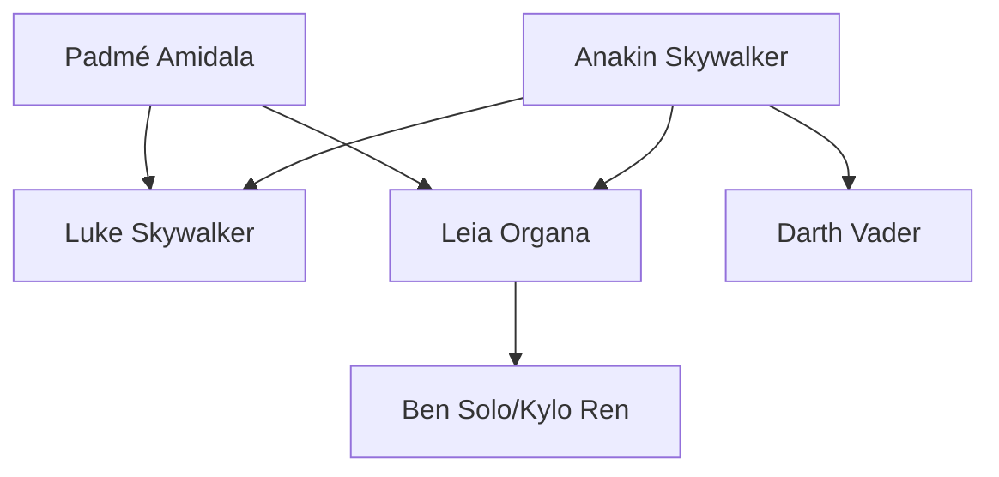

# Star Wars characters

The Star Wars galaxy is filled with memorable characters that have become cultural icons. This guide explores the most significant heroes, villains, and everyone in between.

## Jedi heroes

<CardGroup cols={2}>
  <Card title="Luke Skywalker" icon="sun">
    A farm boy from Tatooine who becomes the galaxy's last hope. Luke trains under Obi-Wan Kenobi and Yoda to become a Jedi Knight, ultimately redeeming his father Darth Vader.
  </Card>
  <Card title="Obi-Wan Kenobi" icon="shield">
    A legendary Jedi Master who trained Anakin Skywalker and later his son Luke. Known for his wisdom, patience, and mastery of defensive lightsaber combat.
  </Card>
  <Card title="Yoda" icon="star">
    The ancient Grand Master of the Jedi Order. At nearly 900 years old, Yoda trained Jedi for over 800 years and is considered one of the most powerful Force users ever.
  </Card>
  <Card title="Mace Windu" icon="bolt">
    A senior member of the Jedi Council and master of Vaapad, a dangerous lightsaber form that channels inner darkness. Known for his purple lightsaber.
  </Card>
</CardGroup>

## Sith villains

| Character | Title | Notable for |
|-----------|-------|-------------|
| **Darth Vader** | Dark Lord of the Sith | Former Jedi Anakin Skywalker, fallen to darkness |
| **Emperor Palpatine** | Galactic Emperor | Orchestrated the fall of the Republic and Jedi Order |
| **Darth Maul** | Sith Apprentice | Double-bladed lightsaber and fierce combat skills |
| **Count Dooku** | Separatist Leader | Former Jedi Master who joined the Sith |
| **Kylo Ren** | Supreme Leader | Ben Solo, grandson of Vader |

## Rebels and resistance

<AccordionGroup>
  <Accordion title="Princess Leia Organa">
    A leader of the Rebel Alliance and later the Resistance. Daughter of Anakin Skywalker and Padmé Amidala, Leia is a skilled diplomat, soldier, and Force-sensitive leader.
  </Accordion>
  <Accordion title="Han Solo">
    A Corellian smuggler who becomes a hero of the Rebellion. Captain of the Millennium Falcon alongside his co-pilot Chewbacca. Known for his quick wit and even quicker draw.
  </Accordion>
  <Accordion title="Chewbacca">
    A Wookiee warrior and Han Solo's loyal co-pilot. Standing over two meters tall, Chewie is a skilled mechanic and fierce fighter with a heart of gold.
  </Accordion>
  <Accordion title="Finn">
    A former First Order stormtrooper who defects to join the Resistance. Designated FN-2187, Finn breaks his conditioning and becomes a hero.
  </Accordion>
  <Accordion title="Rey">
    A scavenger from Jakku who discovers her powerful connection to the Force. She trains under Luke Skywalker and Leia Organa to become a Jedi.
  </Accordion>
</AccordionGroup>

## Droids

The Star Wars universe wouldn't be complete without its beloved droids:

- **R2-D2** - An astromech droid who has been present for nearly every major galactic event
- **C-3PO** - A protocol droid fluent in over six million forms of communication
- **BB-8** - A loyal astromech serving Resistance pilot Poe Dameron
- **K-2SO** - A reprogrammed Imperial security droid with a dry sense of humor

## Bounty hunters

<Warning>
These individuals are dangerous and known throughout the galaxy for their ruthless efficiency.
</Warning>

1. **Boba Fett** - The most feared bounty hunter in the galaxy, clone son of Jango Fett
2. **Jango Fett** - Mandalorian bounty hunter and template for the Clone Army
3. **Din Djarin** - The Mandalorian, protector of Grogu
4. **Cad Bane** - A Duros bounty hunter known for taking on impossible jobs

## Character relationships

<Info>
The Skywalker bloodline is central to all nine films of the main saga, spanning three generations of Force-sensitive individuals.
</Info>
